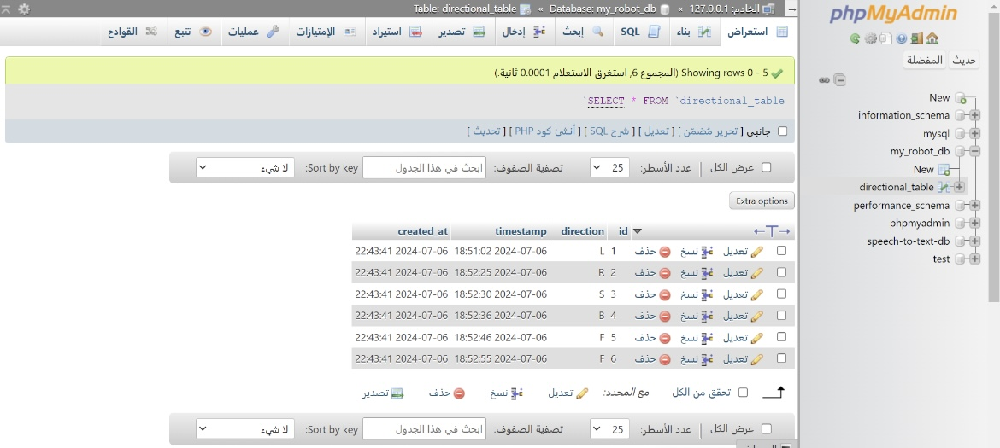
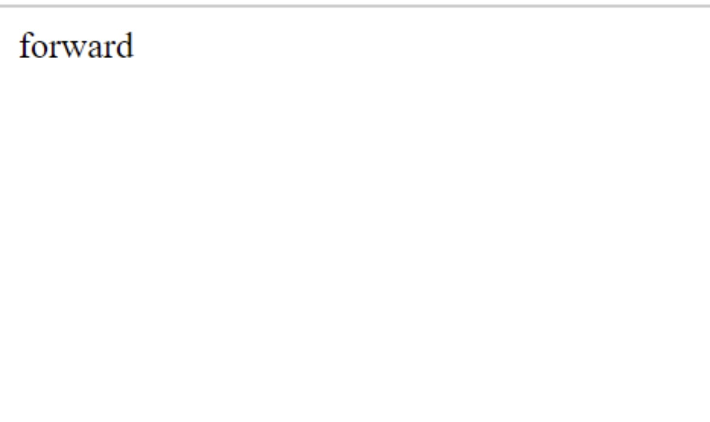
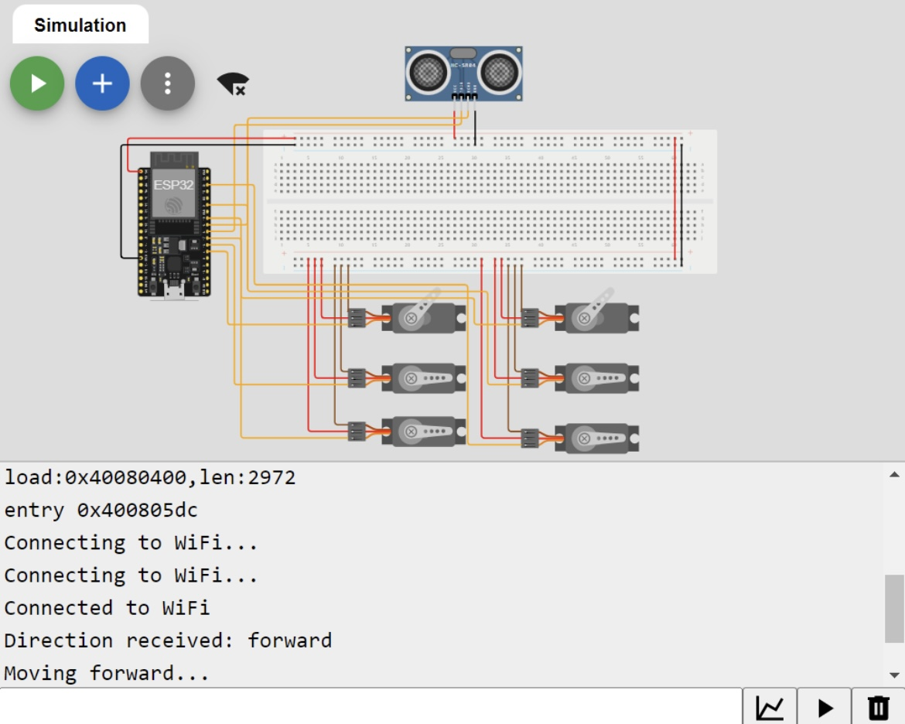

# ESP32 HTTP Request Control

## Description

This repository demonstrates how to use HTTP requests in an ESP32 code to get data from a database and control a robot's movement. The ESP32 retrieves the last movement direction stored in the database and moves the robot accordingly.

## Components Used

- **ESP32**: Microcontroller for controlling the circuit.
- **HC-SR04**: Ultrasonic sensor for distance measurement.
- **Breadboard**: Platform for assembling the circuit.
- **6 Servo Motors**: To control the robot's legs (3 per leg: pelvis, knee, and feet).
- **Wires**: For connecting components.

## Circuit Design

The circuit consists of an ESP32 connected to an HC-SR04 sensor and six servo motors. The servos are distributed as follows:
- **Pelvis Servo**: Controls the robot's hip movement.
- **Knee Servo**: Controls the robot's knee movement.
- **Feet Servo**: Controls the robot's foot movement.

### Connections

1. **HC-SR04 Sensor**:
   - VCC to ESP32 5V
   - GND to ESP32 GND
   - Trig to GPIO pin on ESP32
   - Echo to GPIO pin on ESP32

2. **Servos**:
   - Each servo's signal wire is connected to a GPIO pin on the ESP32.
   - Power and ground wires are connected to the breadboard's power rails.

## Programming

The ESP32 is programmed to make HTTP GET requests to retrieve movement directions from a database. The code includes functions to move the robot in the following directions:
- **Left**
- **Right**
- **Stop**
- **Forward**
- **Backward**

### Steps to Build the Circuit and Program the ESP32

1. **Assemble the Components**: Place the ESP32, HC-SR04 sensor, and servos on the breadboard.
2. **Connect the Wires**: Follow the connection instructions outlined above.
3. **Create PHP and HTML Code**: Develop PHP and HTML code to get the value from the database and print it.
4. **Upload the Code**: Use the Arduino IDE to upload the control code to the ESP32.
5. **Set Up the Web Server**: Deploy the PHP and HTML code on a web server to serve the data.
6. **Integrate with Wokwi**: Insert the web server link into the Wokwi circuit code to enable the ESP32 to read the direction and move the robot.

## Wokwi Circuit Link

You can view and interact with the circuit design on Wokwi using the following link:

[Wokwi Circuit Design](https://wokwi.com/projects/403409215403308033)

## Photos

1. **Database Value in phpMyAdmin**:

2. **Web Server Page**:

3. **Wokwi Circuit with Direction 'Forward'**:

